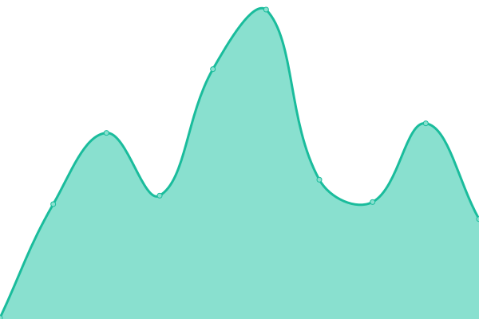

# [📈 Live Status](https://uptime.live4.dev): <!--live status--> **🟩 All systems operational**

This repository contains the open-source uptime monitor and status page for [live4.dev](https://live4.dev), powered by [Upptime](https://github.com/upptime/upptime).

With [Upptime](https://upptime.js.org), you can get your own unlimited and free uptime monitor and status page, powered entirely by a GitHub repository. We use [Issues](https://github.com/live4dev/uptime/issues) as incident reports, [Actions](https://github.com/live4dev/uptime/actions) as uptime monitors, and [Pages](https://uptime.live4.dev) for the status page.

<!--start: status pages-->
<!-- This summary is generated by Upptime (https://github.com/upptime/upptime) -->
<!-- Do not edit this manually, your changes will be overwritten -->
<!-- prettier-ignore -->
| URL | Status | History | Response Time | Uptime |
| --- | ------ | ------- | ------------- | ------ |
|  [uptime.live4.dev](uptime.live4.dev) | 🟩 Up | [uptime-live4-dev.yml](https://github.com/live4dev/uptime.live4.dev/commits/HEAD/history/uptime-live4-dev.yml) | 

 135ms
     
 | 

<a href="https://uptime.live4.dev/history/uptime-live4-dev">100.00%</a>
    

|  [ritasneki.ru](https://ritasneki.ru/) | 🟩 Up | [ritasneki-ru.yml](https://github.com/live4dev/uptime.live4.dev/commits/HEAD/history/ritasneki-ru.yml) | 

 187ms
     
 | 

<a href="https://uptime.live4.dev/history/ritasneki-ru">100.00%</a>
    

|  [live4.dev](https://live4.dev) | 🟩 Up | [live4-dev.yml](https://github.com/live4dev/uptime.live4.dev/commits/HEAD/history/live4-dev.yml) | 

 155ms
     
 | 

<a href="https://uptime.live4.dev/history/live4-dev">100.00%</a>
    

|  [cv.live4.dev](https://cv.live4.dev) | 🟩 Up | [cv-live4-dev.yml](https://github.com/live4dev/uptime.live4.dev/commits/HEAD/history/cv-live4-dev.yml) | 

 144ms
     
 | 

<a href="https://uptime.live4.dev/history/cv-live4-dev">100.00%</a>
    

|  [navyfilms.tv](https://navyfilms.tv) | 🟩 Up | [navyfilms-tv.yml](https://github.com/live4dev/uptime.live4.dev/commits/HEAD/history/navyfilms-tv.yml) | 

 652ms
     
 | 

<a href="https://uptime.live4.dev/history/navyfilms-tv">99.79%</a>
    

|  [proships.ru](https://proships.ru) | 🟩 Up | [proships-ru.yml](https://github.com/live4dev/uptime.live4.dev/commits/HEAD/history/proships-ru.yml) | 

 965ms
     
 | 

<a href="https://uptime.live4.dev/history/proships-ru">100.00%</a>
    

|  [blog.worldofwarships.com](https://blog.worldofwarships.com) | 🟩 Up | [blog-worldofwarships-com.yml](https://github.com/live4dev/uptime.live4.dev/commits/HEAD/history/blog-worldofwarships-com.yml) | 

 651ms
     
 | 

<a href="https://uptime.live4.dev/history/blog-worldofwarships-com">100.00%</a>
    

|  [worldofwarships.ru](https://worldofwarships.ru) | 🟩 Up | [worldofwarships-ru.yml](https://github.com/live4dev/uptime.live4.dev/commits/HEAD/history/worldofwarships-ru.yml) | 

 824ms
     
 | 

<a href="https://uptime.live4.dev/history/worldofwarships-ru">100.00%</a>
    

|  [clans.worldofwarships.ru](https://clans.worldofwarships.ru) | 🟩 Up | [clans-worldofwarships-ru.yml](https://github.com/live4dev/uptime.live4.dev/commits/HEAD/history/clans-worldofwarships-ru.yml) | 

 1340ms
     
 | 

<a href="https://uptime.live4.dev/history/clans-worldofwarships-ru">100.00%</a>
    

|  [armory.worldofwarships.ru](https://armory.worldofwarships.ru) | 🟩 Up | [armory-worldofwarships-ru.yml](https://github.com/live4dev/uptime.live4.dev/commits/HEAD/history/armory-worldofwarships-ru.yml) | 

 943ms
     
 | 

<a href="https://uptime.live4.dev/history/armory-worldofwarships-ru">100.00%</a>
    

|  [dockyard.worldofwarships.ru](https://dockyard.worldofwarships.ru) | 🟩 Up | [dockyard-worldofwarships-ru.yml](https://github.com/live4dev/uptime.live4.dev/commits/HEAD/history/dockyard-worldofwarships-ru.yml) | 

 675ms
     
 | 

<a href="https://uptime.live4.dev/history/dockyard-worldofwarships-ru">100.00%</a>
    

|  [forum.worldofwarships.ru](https://forum.worldofwarships.ru) | 🟩 Up | [forum-worldofwarships-ru.yml](https://github.com/live4dev/uptime.live4.dev/commits/HEAD/history/forum-worldofwarships-ru.yml) | 

 1208ms
     
 | 

<a href="https://uptime.live4.dev/history/forum-worldofwarships-ru">100.00%</a>
    

|  [logbook.worldofwarships.ru](https://logbook.worldofwarships.ru) | 🟩 Up | [logbook-worldofwarships-ru.yml](https://github.com/live4dev/uptime.live4.dev/commits/HEAD/history/logbook-worldofwarships-ru.yml) | 

 521ms
     
 | 

<a href="https://uptime.live4.dev/history/logbook-worldofwarships-ru">100.00%</a>
    

|  [friends.worldofwarships.ru](https://friends.worldofwarships.ru/ru/about) | 🟩 Up | [friends-worldofwarships-ru.yml](https://github.com/live4dev/uptime.live4.dev/commits/HEAD/history/friends-worldofwarships-ru.yml) | 

 735ms
     
 | 

<a href="https://uptime.live4.dev/history/friends-worldofwarships-ru">100.00%</a>
    

|  [warehouse.worldofwarships.ru](https://warehouse.worldofwarships.ru) | 🟩 Up | [warehouse-worldofwarships-ru.yml](https://github.com/live4dev/uptime.live4.dev/commits/HEAD/history/warehouse-worldofwarships-ru.yml) | 

 498ms
     
 | 

<a href="https://uptime.live4.dev/history/warehouse-worldofwarships-ru">100.00%</a>
    

|  [shop.worldofwarships.ru](https://shop.worldofwarships.ru/) | 🟩 Up | [shop-worldofwarships-ru.yml](https://github.com/live4dev/uptime.live4.dev/commits/HEAD/history/shop-worldofwarships-ru.yml) | 

 596ms
     
 | 

<a href="https://uptime.live4.dev/history/shop-worldofwarships-ru">100.00%</a>
    

|  [worldofwarships.com](https://worldofwarships.com) | 🟩 Up | [worldofwarships-com.yml](https://github.com/live4dev/uptime.live4.dev/commits/HEAD/history/worldofwarships-com.yml) | 

 326ms
     
 | 

<a href="https://uptime.live4.dev/history/worldofwarships-com">100.00%</a>
    

|  [clans.worldofwarships.com](https://clans.worldofwarships.com) | 🟩 Up | [clans-worldofwarships-com.yml](https://github.com/live4dev/uptime.live4.dev/commits/HEAD/history/clans-worldofwarships-com.yml) | 

 911ms
     
 | 

<a href="https://uptime.live4.dev/history/clans-worldofwarships-com">100.00%</a>
    

|  [armory.worldofwarships.com](https://armory.worldofwarships.com) | 🟩 Up | [armory-worldofwarships-com.yml](https://github.com/live4dev/uptime.live4.dev/commits/HEAD/history/armory-worldofwarships-com.yml) | 

 377ms
     
 | 

<a href="https://uptime.live4.dev/history/armory-worldofwarships-com">100.00%</a>
    

|  [dockyard.worldofwarships.com](https://dockyard.worldofwarships.com) | 🟩 Up | [dockyard-worldofwarships-com.yml](https://github.com/live4dev/uptime.live4.dev/commits/HEAD/history/dockyard-worldofwarships-com.yml) | 

 264ms
     
 | 

<a href="https://uptime.live4.dev/history/dockyard-worldofwarships-com">100.00%</a>
    

|  [forum.worldofwarships.com](https://forum.worldofwarships.com) | 🟩 Up | [forum-worldofwarships-com.yml](https://github.com/live4dev/uptime.live4.dev/commits/HEAD/history/forum-worldofwarships-com.yml) | 

 596ms
     
 | 

<a href="https://uptime.live4.dev/history/forum-worldofwarships-com">100.00%</a>
    

|  [logbook.worldofwarships.com](https://logbook.worldofwarships.com) | 🟩 Up | [logbook-worldofwarships-com.yml](https://github.com/live4dev/uptime.live4.dev/commits/HEAD/history/logbook-worldofwarships-com.yml) | 

 273ms
     
 | 

<a href="https://uptime.live4.dev/history/logbook-worldofwarships-com">100.00%</a>
    

|  [friends.worldofwarships.com](https://friends.worldofwarships.com/en/about) | 🟩 Up | [friends-worldofwarships-com.yml](https://github.com/live4dev/uptime.live4.dev/commits/HEAD/history/friends-worldofwarships-com.yml) | 

 299ms
     
 | 

<a href="https://uptime.live4.dev/history/friends-worldofwarships-com">100.00%</a>
    

|  [warehouse.worldofwarships.com](https://warehouse.worldofwarships.com) | 🟩 Up | [warehouse-worldofwarships-com.yml](https://github.com/live4dev/uptime.live4.dev/commits/HEAD/history/warehouse-worldofwarships-com.yml) | 

 216ms
     
 | 

<a href="https://uptime.live4.dev/history/warehouse-worldofwarships-com">100.00%</a>
    

|  [shop.worldofwarships.com](https://shop.worldofwarships.com/) | 🟩 Up | [shop-worldofwarships-com.yml](https://github.com/live4dev/uptime.live4.dev/commits/HEAD/history/shop-worldofwarships-com.yml) | 

 375ms
     
 | 

<a href="https://uptime.live4.dev/history/shop-worldofwarships-com">100.00%</a>
    

|  [worldofwarships.eu](https://worldofwarships.eu) | 🟩 Up | [worldofwarships-eu.yml](https://github.com/live4dev/uptime.live4.dev/commits/HEAD/history/worldofwarships-eu.yml) | 

 539ms
     
 | 

<a href="https://uptime.live4.dev/history/worldofwarships-eu">100.00%</a>
    

|  [clans.worldofwarships.eu](https://clans.worldofwarships.eu) | 🟩 Up | [clans-worldofwarships-eu.yml](https://github.com/live4dev/uptime.live4.dev/commits/HEAD/history/clans-worldofwarships-eu.yml) | 

 1234ms
     
 | 

<a href="https://uptime.live4.dev/history/clans-worldofwarships-eu">100.00%</a>
    

|  [armory.worldofwarships.eu](https://armory.worldofwarships.eu) | 🟩 Up | [armory-worldofwarships-eu.yml](https://github.com/live4dev/uptime.live4.dev/commits/HEAD/history/armory-worldofwarships-eu.yml) | 

 614ms
     
 | 

<a href="https://uptime.live4.dev/history/armory-worldofwarships-eu">100.00%</a>
    

|  [dockyard.worldofwarships.eu](https://dockyard.worldofwarships.eu) | 🟩 Up | [dockyard-worldofwarships-eu.yml](https://github.com/live4dev/uptime.live4.dev/commits/HEAD/history/dockyard-worldofwarships-eu.yml) | 

 456ms
     
 | 

<a href="https://uptime.live4.dev/history/dockyard-worldofwarships-eu">100.00%</a>
    

|  [logbook.worldofwarships.eu](https://logbook.worldofwarships.eu) | 🟩 Up | [logbook-worldofwarships-eu.yml](https://github.com/live4dev/uptime.live4.dev/commits/HEAD/history/logbook-worldofwarships-eu.yml) | 

 457ms
     
 | 

<a href="https://uptime.live4.dev/history/logbook-worldofwarships-eu">100.00%</a>
    

|  [friends.worldofwarships.eu](https://friends.worldofwarships.eu/en/about) | 🟩 Up | [friends-worldofwarships-eu.yml](https://github.com/live4dev/uptime.live4.dev/commits/HEAD/history/friends-worldofwarships-eu.yml) | 

 491ms
     
 | 

<a href="https://uptime.live4.dev/history/friends-worldofwarships-eu">100.00%</a>
    

|  [warehouse.worldofwarships.eu](https://warehouse.worldofwarships.eu) | 🟩 Up | [warehouse-worldofwarships-eu.yml](https://github.com/live4dev/uptime.live4.dev/commits/HEAD/history/warehouse-worldofwarships-eu.yml) | 

 373ms
     
 | 

<a href="https://uptime.live4.dev/history/warehouse-worldofwarships-eu">100.00%</a>
    

|  [shop.worldofwarships.eu](https://shop.worldofwarships.eu/) | 🟩 Up | [shop-worldofwarships-eu.yml](https://github.com/live4dev/uptime.live4.dev/commits/HEAD/history/shop-worldofwarships-eu.yml) | 

 589ms
     
 | 

<a href="https://uptime.live4.dev/history/shop-worldofwarships-eu">100.00%</a>
    

|  [worldofwarships.asia](https://worldofwarships.asia) | 🟩 Up | [worldofwarships-asia.yml](https://github.com/live4dev/uptime.live4.dev/commits/HEAD/history/worldofwarships-asia.yml) | 

 1392ms
     
 | 

<a href="https://uptime.live4.dev/history/worldofwarships-asia">100.00%</a>
    

|  [clans.worldofwarships.asia](https://clans.worldofwarships.asia) | 🟩 Up | [clans-worldofwarships-asia.yml](https://github.com/live4dev/uptime.live4.dev/commits/HEAD/history/clans-worldofwarships-asia.yml) | 

 2646ms
     
 | 

<a href="https://uptime.live4.dev/history/clans-worldofwarships-asia">100.00%</a>
    

|  [armory.worldofwarships.asia](https://armory.worldofwarships.asia) | 🟩 Up | [armory-worldofwarships-asia.yml](https://github.com/live4dev/uptime.live4.dev/commits/HEAD/history/armory-worldofwarships-asia.yml) | 

 1228ms
     
 | 

<a href="https://uptime.live4.dev/history/armory-worldofwarships-asia">100.00%</a>
    

|  [dockyard.worldofwarships.asia](https://dockyard.worldofwarships.asia) | 🟩 Up | [dockyard-worldofwarships-asia.yml](https://github.com/live4dev/uptime.live4.dev/commits/HEAD/history/dockyard-worldofwarships-asia.yml) | 

 1025ms
     
 | 

<a href="https://uptime.live4.dev/history/dockyard-worldofwarships-asia">100.00%</a>
    

|  [forum.worldofwarships.asia](https://forum.worldofwarships.asia) | 🟩 Up | [forum-worldofwarships-asia.yml](https://github.com/live4dev/uptime.live4.dev/commits/HEAD/history/forum-worldofwarships-asia.yml) | 

 1551ms
     
 | 

<a href="https://uptime.live4.dev/history/forum-worldofwarships-asia">100.00%</a>
    

|  [logbook.worldofwarships.asia](https://logbook.worldofwarships.asia) | 🟩 Up | [logbook-worldofwarships-asia.yml](https://github.com/live4dev/uptime.live4.dev/commits/HEAD/history/logbook-worldofwarships-asia.yml) | 

 934ms
     
 | 

<a href="https://uptime.live4.dev/history/logbook-worldofwarships-asia">100.00%</a>
    

|  [friends.worldofwarships.asia](https://friends.worldofwarships.asia/en/about) | 🟩 Up | [friends-worldofwarships-asia.yml](https://github.com/live4dev/uptime.live4.dev/commits/HEAD/history/friends-worldofwarships-asia.yml) | 

 985ms
     
 | 

<a href="https://uptime.live4.dev/history/friends-worldofwarships-asia">100.00%</a>
    

|  [warehouse.worldofwarships.asia](https://warehouse.worldofwarships.asia) | 🟩 Up | [warehouse-worldofwarships-asia.yml](https://github.com/live4dev/uptime.live4.dev/commits/HEAD/history/warehouse-worldofwarships-asia.yml) | 

 776ms
     
 | 

<a href="https://uptime.live4.dev/history/warehouse-worldofwarships-asia">100.00%</a>
    

|  [shop.worldofwarships.asia](https://shop.worldofwarships.asia/) | 🟩 Up | [shop-worldofwarships-asia.yml](https://github.com/live4dev/uptime.live4.dev/commits/HEAD/history/shop-worldofwarships-asia.yml) | 

 1318ms
     
 | 

<a href="https://uptime.live4.dev/history/shop-worldofwarships-asia">100.00%</a>
    

<!--end: status pages-->

[**Visit our status website →**](https://uptime.live4.dev)

## 📄 License

- Powered by: [Upptime](https://github.com/upptime/upptime)
- Code: [MIT](./LICENSE) © [live4.dev](https://live4.dev)
- Data in the `./history` directory: [Open Database License](https://opendatacommons.org/licenses/odbl/1-0/)
