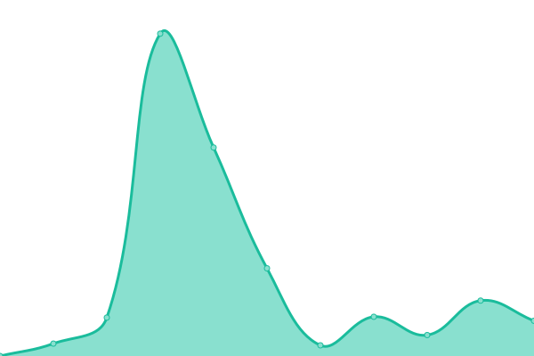

# [📈 Live Status](https://uptime.live4.dev): <!--live status--> **🟧 Partial outage**

This repository contains the open-source uptime monitor and status page for [live4.dev](https://live4.dev), powered by [Upptime](https://github.com/upptime/upptime).

With [Upptime](https://upptime.js.org), you can get your own unlimited and free uptime monitor and status page, powered entirely by a GitHub repository. We use [Issues](https://github.com/live4dev/uptime/issues) as incident reports, [Actions](https://github.com/live4dev/uptime/actions) as uptime monitors, and [Pages](https://uptime.live4.dev) for the status page.

<!--start: status pages-->
<!-- This summary is generated by Upptime (https://github.com/upptime/upptime) -->
<!-- Do not edit this manually, your changes will be overwritten -->
<!-- prettier-ignore -->
| URL | Status | History | Response Time | Uptime |
| --- | ------ | ------- | ------------- | ------ |
|  [uptime.live4.dev](uptime.live4.dev) | 🟩 Up | [uptime-live4-dev.yml](https://github.com/live4dev/uptime.live4.dev/commits/HEAD/history/uptime-live4-dev.yml) | 

 144ms
     
 | 

<a href="https://uptime.live4.dev/history/uptime-live4-dev">100.00%</a>
    

|  [proships.ru](https://proships.ru) | 🟩 Up | [proships-ru.yml](https://github.com/live4dev/uptime.live4.dev/commits/HEAD/history/proships-ru.yml) | 

 1997ms
     
 | 

<a href="https://uptime.live4.dev/history/proships-ru">100.00%</a>
    

|  [korabli.su](https://korabli.su) | 🟩 Up | [korabli-su.yml](https://github.com/live4dev/uptime.live4.dev/commits/HEAD/history/korabli-su.yml) | 

 1037ms
     
 | 

<a href="https://uptime.live4.dev/history/korabli-su">100.00%</a>
    

|  [wiki.lesta.ru](https://wiki.lesta.ru) | 🟥 Down | [wiki-lesta-ru.yml](https://github.com/live4dev/uptime.live4.dev/commits/HEAD/history/wiki-lesta-ru.yml) | 

 0ms
     
 | 

<a href="https://uptime.live4.dev/history/wiki-lesta-ru">100.00%</a>
    

|  [tanki.su](https://tanki.su) | 🟩 Up | [tanki-su.yml](https://github.com/live4dev/uptime.live4.dev/commits/HEAD/history/tanki-su.yml) | 

 4363ms
     
 | 

<a href="https://uptime.live4.dev/history/tanki-su">99.37%</a>
    

|  [forum.tanki.su](https://forum.tanki.su) | 🟩 Up | [forum-tanki-su.yml](https://github.com/live4dev/uptime.live4.dev/commits/HEAD/history/forum-tanki-su.yml) | 

 1293ms
     
 | 

<a href="https://uptime.live4.dev/history/forum-tanki-su">100.00%</a>
    

|  [lesta.ru/shop](https://lesta.ru/shop) | 🟥 Down | [lesta-ru-shop.yml](https://github.com/live4dev/uptime.live4.dev/commits/HEAD/history/lesta-ru-shop.yml) | 

 3854ms
     
 | 

<a href="https://uptime.live4.dev/history/lesta-ru-shop">99.54%</a>
    

|  [clans.korabli.su](https://clans.korabli.su) | 🟩 Up | [clans-korabli-su.yml](https://github.com/live4dev/uptime.live4.dev/commits/HEAD/history/clans-korabli-su.yml) | 

 2217ms
     
 | 

<a href="https://uptime.live4.dev/history/clans-korabli-su">100.00%</a>
    

|  [armory.korabli.su](https://armory.korabli.su) | 🟩 Up | [armory-korabli-su.yml](https://github.com/live4dev/uptime.live4.dev/commits/HEAD/history/armory-korabli-su.yml) | 

 4499ms
     
 | 

<a href="https://uptime.live4.dev/history/armory-korabli-su">99.00%</a>
    

|  [dockyard.korabli.su](https://dockyard.korabli.su) | 🟩 Up | [dockyard-korabli-su.yml](https://github.com/live4dev/uptime.live4.dev/commits/HEAD/history/dockyard-korabli-su.yml) | 

 1136ms
     
 | 

<a href="https://uptime.live4.dev/history/dockyard-korabli-su">100.00%</a>
    

|  [forum.korabli.su](https://forum.korabli.su) | 🟩 Up | [forum-korabli-su.yml](https://github.com/live4dev/uptime.live4.dev/commits/HEAD/history/forum-korabli-su.yml) | 

 1355ms
     
 | 

<a href="https://uptime.live4.dev/history/forum-korabli-su">100.00%</a>
    

|  [logbook.korabli.su](https://logbook.korabli.su) | 🟩 Up | [logbook-korabli-su.yml](https://github.com/live4dev/uptime.live4.dev/commits/HEAD/history/logbook-korabli-su.yml) | 

 928ms
     
 | 

<a href="https://uptime.live4.dev/history/logbook-korabli-su">100.00%</a>
    

|  [friends.korabli.su](https://friends.korabli.su/ru/about) | 🟩 Up | [friends-korabli-su.yml](https://github.com/live4dev/uptime.live4.dev/commits/HEAD/history/friends-korabli-su.yml) | 

 1153ms
     
 | 

<a href="https://uptime.live4.dev/history/friends-korabli-su">100.00%</a>
    

|  [warehouse.korabli.su](https://warehouse.korabli.su) | 🟩 Up | [warehouse-korabli-su.yml](https://github.com/live4dev/uptime.live4.dev/commits/HEAD/history/warehouse-korabli-su.yml) | 

 1001ms
     
 | 

<a href="https://uptime.live4.dev/history/warehouse-korabli-su">100.00%</a>
    

|  [blog.korabli.su](https://warehouse.korabli.su) | 🟩 Up | [blog-korabli-su.yml](https://github.com/live4dev/uptime.live4.dev/commits/HEAD/history/blog-korabli-su.yml) | 

 154ms
     
 | 

<a href="https://uptime.live4.dev/history/blog-korabli-su">100.00%</a>
    

|  [shop.korabli.su](https://shop.korabli.su/) | 🟩 Up | [shop-korabli-su.yml](https://github.com/live4dev/uptime.live4.dev/commits/HEAD/history/shop-korabli-su.yml) | 

 1018ms
     
 | 

<a href="https://uptime.live4.dev/history/shop-korabli-su">100.00%</a>
    

|  [worldofwarships.com](https://worldofwarships.com) | 🟩 Up | [worldofwarships-com.yml](https://github.com/live4dev/uptime.live4.dev/commits/HEAD/history/worldofwarships-com.yml) | 

 312ms
     
 | 

<a href="https://uptime.live4.dev/history/worldofwarships-com">100.00%</a>
    

|  [clans.worldofwarships.com](https://clans.worldofwarships.com) | 🟩 Up | [clans-worldofwarships-com.yml](https://github.com/live4dev/uptime.live4.dev/commits/HEAD/history/clans-worldofwarships-com.yml) | 

 830ms
     
 | 

<a href="https://uptime.live4.dev/history/clans-worldofwarships-com">100.00%</a>
    

|  [armory.worldofwarships.com](https://armory.worldofwarships.com) | 🟩 Up | [armory-worldofwarships-com.yml](https://github.com/live4dev/uptime.live4.dev/commits/HEAD/history/armory-worldofwarships-com.yml) | 

 1094ms
     
 | 

<a href="https://uptime.live4.dev/history/armory-worldofwarships-com">100.00%</a>
    

|  [blog.worldofwarships.com](https://blog.worldofwarships.com) | 🟩 Up | [blog-worldofwarships-com.yml](https://github.com/live4dev/uptime.live4.dev/commits/HEAD/history/blog-worldofwarships-com.yml) | 

 800ms
     
 | 

<a href="https://uptime.live4.dev/history/blog-worldofwarships-com">100.00%</a>
    

|  [dockyard.worldofwarships.com](https://dockyard.worldofwarships.com) | 🟩 Up | [dockyard-worldofwarships-com.yml](https://github.com/live4dev/uptime.live4.dev/commits/HEAD/history/dockyard-worldofwarships-com.yml) | 

 314ms
     
 | 

<a href="https://uptime.live4.dev/history/dockyard-worldofwarships-com">100.00%</a>
    

|  [logbook.worldofwarships.com](https://logbook.worldofwarships.com) | 🟩 Up | [logbook-worldofwarships-com.yml](https://github.com/live4dev/uptime.live4.dev/commits/HEAD/history/logbook-worldofwarships-com.yml) | 

 325ms
     
 | 

<a href="https://uptime.live4.dev/history/logbook-worldofwarships-com">100.00%</a>
    

|  [friends.worldofwarships.com](https://friends.worldofwarships.com/en/about) | 🟩 Up | [friends-worldofwarships-com.yml](https://github.com/live4dev/uptime.live4.dev/commits/HEAD/history/friends-worldofwarships-com.yml) | 

 280ms
     
 | 

<a href="https://uptime.live4.dev/history/friends-worldofwarships-com">100.00%</a>
    

|  [warehouse.worldofwarships.com](https://warehouse.worldofwarships.com) | 🟥 Down | [warehouse-worldofwarships-com.yml](https://github.com/live4dev/uptime.live4.dev/commits/HEAD/history/warehouse-worldofwarships-com.yml) | 

 205ms
     
 | 

<a href="https://uptime.live4.dev/history/warehouse-worldofwarships-com">0.00%</a>
    

|  [shop.worldofwarships.com](https://shop.worldofwarships.com/) | 🟩 Up | [shop-worldofwarships-com.yml](https://github.com/live4dev/uptime.live4.dev/commits/HEAD/history/shop-worldofwarships-com.yml) | 

 359ms
     
 | 

<a href="https://uptime.live4.dev/history/shop-worldofwarships-com">100.00%</a>
    

|  [worldofwarships.eu](https://worldofwarships.eu) | 🟩 Up | [worldofwarships-eu.yml](https://github.com/live4dev/uptime.live4.dev/commits/HEAD/history/worldofwarships-eu.yml) | 

 692ms
     
 | 

<a href="https://uptime.live4.dev/history/worldofwarships-eu">100.00%</a>
    

|  [clans.worldofwarships.eu](https://clans.worldofwarships.eu) | 🟩 Up | [clans-worldofwarships-eu.yml](https://github.com/live4dev/uptime.live4.dev/commits/HEAD/history/clans-worldofwarships-eu.yml) | 

 1452ms
     
 | 

<a href="https://uptime.live4.dev/history/clans-worldofwarships-eu">100.00%</a>
    

|  [armory.worldofwarships.eu](https://armory.worldofwarships.eu) | 🟩 Up | [armory-worldofwarships-eu.yml](https://github.com/live4dev/uptime.live4.dev/commits/HEAD/history/armory-worldofwarships-eu.yml) | 

 1982ms
     
 | 

<a href="https://uptime.live4.dev/history/armory-worldofwarships-eu">100.00%</a>
    

|  [dockyard.worldofwarships.eu](https://dockyard.worldofwarships.eu) | 🟩 Up | [dockyard-worldofwarships-eu.yml](https://github.com/live4dev/uptime.live4.dev/commits/HEAD/history/dockyard-worldofwarships-eu.yml) | 

 495ms
     
 | 

<a href="https://uptime.live4.dev/history/dockyard-worldofwarships-eu">100.00%</a>
    

|  [logbook.worldofwarships.eu](https://logbook.worldofwarships.eu) | 🟩 Up | [logbook-worldofwarships-eu.yml](https://github.com/live4dev/uptime.live4.dev/commits/HEAD/history/logbook-worldofwarships-eu.yml) | 

 470ms
     
 | 

<a href="https://uptime.live4.dev/history/logbook-worldofwarships-eu">100.00%</a>
    

|  [friends.worldofwarships.eu](https://friends.worldofwarships.eu/en/about) | 🟩 Up | [friends-worldofwarships-eu.yml](https://github.com/live4dev/uptime.live4.dev/commits/HEAD/history/friends-worldofwarships-eu.yml) | 

 619ms
     
 | 

<a href="https://uptime.live4.dev/history/friends-worldofwarships-eu">100.00%</a>
    

|  [warehouse.worldofwarships.eu](https://warehouse.worldofwarships.eu) | 🟥 Down | [warehouse-worldofwarships-eu.yml](https://github.com/live4dev/uptime.live4.dev/commits/HEAD/history/warehouse-worldofwarships-eu.yml) | 

 479ms
     
 | 

<a href="https://uptime.live4.dev/history/warehouse-worldofwarships-eu">0.00%</a>
    

|  [shop.worldofwarships.eu](https://shop.worldofwarships.eu/) | 🟩 Up | [shop-worldofwarships-eu.yml](https://github.com/live4dev/uptime.live4.dev/commits/HEAD/history/shop-worldofwarships-eu.yml) | 

 630ms
     
 | 

<a href="https://uptime.live4.dev/history/shop-worldofwarships-eu">100.00%</a>
    

|  [worldofwarships.asia](https://worldofwarships.asia) | 🟩 Up | [worldofwarships-asia.yml](https://github.com/live4dev/uptime.live4.dev/commits/HEAD/history/worldofwarships-asia.yml) | 

 1213ms
     
 | 

<a href="https://uptime.live4.dev/history/worldofwarships-asia">100.00%</a>
    

|  [clans.worldofwarships.asia](https://clans.worldofwarships.asia) | 🟩 Up | [clans-worldofwarships-asia.yml](https://github.com/live4dev/uptime.live4.dev/commits/HEAD/history/clans-worldofwarships-asia.yml) | 

 2360ms
     
 | 

<a href="https://uptime.live4.dev/history/clans-worldofwarships-asia">100.00%</a>
    

|  [armory.worldofwarships.asia](https://armory.worldofwarships.asia) | 🟩 Up | [armory-worldofwarships-asia.yml](https://github.com/live4dev/uptime.live4.dev/commits/HEAD/history/armory-worldofwarships-asia.yml) | 

 2924ms
     
 | 

<a href="https://uptime.live4.dev/history/armory-worldofwarships-asia">100.00%</a>
    

|  [dockyard.worldofwarships.asia](https://dockyard.worldofwarships.asia) | 🟩 Up | [dockyard-worldofwarships-asia.yml](https://github.com/live4dev/uptime.live4.dev/commits/HEAD/history/dockyard-worldofwarships-asia.yml) | 

 847ms
     
 | 

<a href="https://uptime.live4.dev/history/dockyard-worldofwarships-asia">100.00%</a>
    

|  [logbook.worldofwarships.asia](https://logbook.worldofwarships.asia) | 🟩 Up | [logbook-worldofwarships-asia.yml](https://github.com/live4dev/uptime.live4.dev/commits/HEAD/history/logbook-worldofwarships-asia.yml) | 

 822ms
     
 | 

<a href="https://uptime.live4.dev/history/logbook-worldofwarships-asia">100.00%</a>
    

|  [friends.worldofwarships.asia](https://friends.worldofwarships.asia/en/about) | 🟩 Up | [friends-worldofwarships-asia.yml](https://github.com/live4dev/uptime.live4.dev/commits/HEAD/history/friends-worldofwarships-asia.yml) | 

 1058ms
     
 | 

<a href="https://uptime.live4.dev/history/friends-worldofwarships-asia">100.00%</a>
    

|  [warehouse.worldofwarships.asia](https://warehouse.worldofwarships.asia) | 🟥 Down | [warehouse-worldofwarships-asia.yml](https://github.com/live4dev/uptime.live4.dev/commits/HEAD/history/warehouse-worldofwarships-asia.yml) | 

 810ms
     
 | 

<a href="https://uptime.live4.dev/history/warehouse-worldofwarships-asia">0.00%</a>
    

|  [shop.worldofwarships.asia](https://shop.worldofwarships.asia/) | 🟩 Up | [shop-worldofwarships-asia.yml](https://github.com/live4dev/uptime.live4.dev/commits/HEAD/history/shop-worldofwarships-asia.yml) | 

 964ms
     
 | 

<a href="https://uptime.live4.dev/history/shop-worldofwarships-asia">100.00%</a>
    

<!--end: status pages-->

[**Visit our status website →**](https://uptime.live4.dev)

## 📄 License

- Powered by: [Upptime](https://github.com/upptime/upptime)
- Code: [MIT](./LICENSE) © [live4.dev](https://live4.dev)
- Data in the `./history` directory: [Open Database License](https://opendatacommons.org/licenses/odbl/1-0/)
