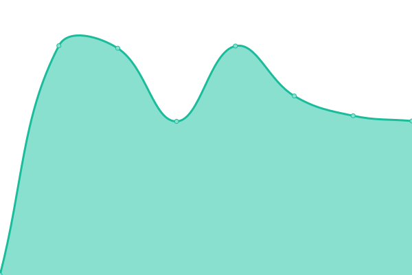
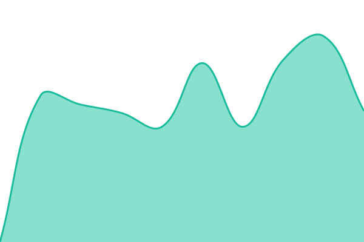

# [📈 Live Status](https://uptime.live4.dev): <!--live status--> **🟧 Partial outage**

This repository contains the open-source uptime monitor and status page for [live4.dev](https://live4.dev), powered by [Upptime](https://github.com/upptime/upptime).

With [Upptime](https://upptime.js.org), you can get your own unlimited and free uptime monitor and status page, powered entirely by a GitHub repository. We use [Issues](https://github.com/live4dev/uptime/issues) as incident reports, [Actions](https://github.com/live4dev/uptime/actions) as uptime monitors, and [Pages](https://uptime.live4.dev) for the status page.

<!--start: status pages-->
<!-- This summary is generated by Upptime (https://github.com/upptime/upptime) -->
<!-- Do not edit this manually, your changes will be overwritten -->
<!-- prettier-ignore -->
| URL | Status | History | Response Time | Uptime |
| --- | ------ | ------- | ------------- | ------ |
|  [uptime.live4.dev](uptime.live4.dev) | 🟩 Up | [uptime-live4-dev.yml](https://github.com/live4dev/uptime.live4.dev/commits/HEAD/history/uptime-live4-dev.yml) | 

 386ms
     
 | 

<a href="https://uptime.live4.dev/history/uptime-live4-dev">100.00%</a>
    

|  [proships.ru](https://proships.ru) | 🟥 Down | [proships-ru.yml](https://github.com/live4dev/uptime.live4.dev/commits/HEAD/history/proships-ru.yml) | 

 0ms
     
 | 

<a href="https://uptime.live4.dev/history/proships-ru">0.00%</a>
    

|  [korabli.su](https://korabli.su) | 🟩 Up | [korabli-su.yml](https://github.com/live4dev/uptime.live4.dev/commits/HEAD/history/korabli-su.yml) | 

 1201ms
     
 | 

<a href="https://uptime.live4.dev/history/korabli-su">100.00%</a>
    

|  [wiki.lesta.ru](https://wiki.lesta.ru) | 🟥 Down | [wiki-lesta-ru.yml](https://github.com/live4dev/uptime.live4.dev/commits/HEAD/history/wiki-lesta-ru.yml) | 

 0ms
     
 | 

<a href="https://uptime.live4.dev/history/wiki-lesta-ru">100.00%</a>
    

|  [forum.tanki.su](https://forum.tanki.su) | 🟩 Up | [forum-tanki-su.yml](https://github.com/live4dev/uptime.live4.dev/commits/HEAD/history/forum-tanki-su.yml) | 

 3079ms
     
 | 

<a href="https://uptime.live4.dev/history/forum-tanki-su">100.00%</a>
    

|  [clans.korabli.su](https://clans.korabli.su) | 🟩 Up | [clans-korabli-su.yml](https://github.com/live4dev/uptime.live4.dev/commits/HEAD/history/clans-korabli-su.yml) | 

 3026ms
     
 | 

<a href="https://uptime.live4.dev/history/clans-korabli-su">100.00%</a>
    

|  [armory.korabli.su](https://armory.korabli.su) | 🟩 Up | [armory-korabli-su.yml](https://github.com/live4dev/uptime.live4.dev/commits/HEAD/history/armory-korabli-su.yml) | 

 3937ms
     
 | 

<a href="https://uptime.live4.dev/history/armory-korabli-su">100.00%</a>
    

|  [dockyard.korabli.su](https://dockyard.korabli.su) | 🟩 Up | [dockyard-korabli-su.yml](https://github.com/live4dev/uptime.live4.dev/commits/HEAD/history/dockyard-korabli-su.yml) | 

 818ms
     
 | 

<a href="https://uptime.live4.dev/history/dockyard-korabli-su">100.00%</a>
    

|  [forum.korabli.su](https://forum.korabli.su) | 🟩 Up | [forum-korabli-su.yml](https://github.com/live4dev/uptime.live4.dev/commits/HEAD/history/forum-korabli-su.yml) | 

 1701ms
     
 | 

<a href="https://uptime.live4.dev/history/forum-korabli-su">100.00%</a>
    

|  [logbook.korabli.su](https://logbook.korabli.su) | 🟩 Up | [logbook-korabli-su.yml](https://github.com/live4dev/uptime.live4.dev/commits/HEAD/history/logbook-korabli-su.yml) | 

 1807ms
     
 | 

<a href="https://uptime.live4.dev/history/logbook-korabli-su">100.00%</a>
    

|  [friends.korabli.su](https://friends.korabli.su/ru/about) | 🟩 Up | [friends-korabli-su.yml](https://github.com/live4dev/uptime.live4.dev/commits/HEAD/history/friends-korabli-su.yml) | 

 849ms
     
 | 

<a href="https://uptime.live4.dev/history/friends-korabli-su">100.00%</a>
    

|  [warehouse.korabli.su](https://warehouse.korabli.su) | 🟩 Up | [warehouse-korabli-su.yml](https://github.com/live4dev/uptime.live4.dev/commits/HEAD/history/warehouse-korabli-su.yml) | 

 1009ms
     
 | 

<a href="https://uptime.live4.dev/history/warehouse-korabli-su">100.00%</a>
    

|  [blog.korabli.su](https://warehouse.korabli.su) | 🟩 Up | [blog-korabli-su.yml](https://github.com/live4dev/uptime.live4.dev/commits/HEAD/history/blog-korabli-su.yml) | 

 856ms
     
 | 

<a href="https://uptime.live4.dev/history/blog-korabli-su">100.00%</a>
    

|  [shop.korabli.su](https://shop.korabli.su/) | 🟩 Up | [shop-korabli-su.yml](https://github.com/live4dev/uptime.live4.dev/commits/HEAD/history/shop-korabli-su.yml) | 

 3764ms
     
 | 

<a href="https://uptime.live4.dev/history/shop-korabli-su">100.00%</a>
    

|  [worldofwarships.eu](https://worldofwarships.eu) | 🟩 Up | [worldofwarships-eu.yml](https://github.com/live4dev/uptime.live4.dev/commits/HEAD/history/worldofwarships-eu.yml) | 

 714ms
     
 | 

<a href="https://uptime.live4.dev/history/worldofwarships-eu">100.00%</a>
    

|  [armory.worldofwarships.eu](https://armory.worldofwarships.eu) | 🟩 Up | [armory-worldofwarships-eu.yml](https://github.com/live4dev/uptime.live4.dev/commits/HEAD/history/armory-worldofwarships-eu.yml) | 

 2081ms
     
 | 

<a href="https://uptime.live4.dev/history/armory-worldofwarships-eu">95.96%</a>
    

|  [dockyard.worldofwarships.eu](https://dockyard.worldofwarships.eu) | 🟩 Up | [dockyard-worldofwarships-eu.yml](https://github.com/live4dev/uptime.live4.dev/commits/HEAD/history/dockyard-worldofwarships-eu.yml) | 

 528ms
     
 | 

<a href="https://uptime.live4.dev/history/dockyard-worldofwarships-eu">100.00%</a>
    

|  [shop.worldofwarships.eu](https://shop.worldofwarships.eu/) | 🟩 Up | [shop-worldofwarships-eu.yml](https://github.com/live4dev/uptime.live4.dev/commits/HEAD/history/shop-worldofwarships-eu.yml) | 

 1088ms
     
 | 

<a href="https://uptime.live4.dev/history/shop-worldofwarships-eu">100.00%</a>
    

<!--end: status pages-->

[**Visit our status website →**](https://uptime.live4.dev)

## 📄 License

- Powered by: [Upptime](https://github.com/upptime/upptime)
- Code: [MIT](./LICENSE) © [live4.dev](https://live4.dev)
- Data in the `./history` directory: [Open Database License](https://opendatacommons.org/licenses/odbl/1-0/)
